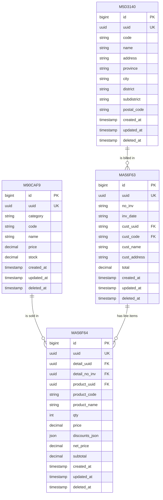

# Installation

## 1. Install PHP dependencies

Install Laravel dependencies using Composer:

```bash
composer install
```

---

## 2. Configure environment variables

Copy the example environment file:

### macOS / Linux

```bash
cp .env.example .env
```

### Windows PowerShell

```powershell
Copy-Item .env.example .env
```

Generate the application key:

```bash
php artisan key:generate
```

---

## 3. Setup SQLite database

Create the SQLite database file:

### macOS / Linux

```bash
touch database/database.sqlite
```

### Windows PowerShell

```powershell
New-Item database/database.sqlite -ItemType File
```

Update your `.env` file:

```env
DB_CONNECTION=sqlite
DB_DATABASE=database/database.sqlite
```

Run database migrations:

```bash
php artisan migrate
```

---

## 4. Install frontend dependencies

Install Node packages:

```bash
npm install
```

---

## 5. Build frontend assets

For development:

```bash
npm run dev
```

For production:

```bash
npm run build
```

---

# Running the Application

You need two terminal windows.

## Terminal 1: Laravel server

```bash
php artisan serve
```

The application will be available at:

```
http://127.0.0.1:8000
```

---

## Terminal 2: Vite development server

```bash
npm run dev
```

---

# Database

This project currently uses SQLite.

Database file:

```
database/database.sqlite
```

To reset the database:

```bash
php artisan migrate:fresh
```

To run migrations with sample data:

```bash
php artisan migrate:fresh --seed
```

## Database Schema

This application uses four core tables. Table names are obfuscated hashes (`M90CAF9`, `M5D3140`, `MA56F63`, `MA56F64`) rather than descriptive names — the mapping to their business meaning is documented below.

| Table | Meaning | Model |
|---|---|---|
| `M90CAF9` | Products (master data) | `M90CAF9` |
| `M5D3140` | Customers (master data) | `M5D3140` |
| `MA56F63` | Sales Transaction (header / invoice) | `MA56F63` |
| `MA56F64` | Sales Transaction Detail (line items) | *(not shown, referenced via `items` relation)* |

### Entity-Relationship Diagram



### Table Details

#### `M5D3140` — Customers
Master data for customers.

| Column | Type | Notes |
|---|---|---|
| `uuid` | uuid, unique | Public identifier, used across the app instead of `id` |
| `code` | string(64) | Customer code (e.g. shown in invoice as `cust_code`) |
| `name`, `address` | string(255) | Snapshotted onto transactions at time of sale |
| `province` / `city` / `district` / `subdistrict` / `postal_code` | string(255) | Full address breakdown |
| *(soft deletes)* | | Customers are never hard-deleted |

#### `M90CAF9` — Products
Master data for products, including live stock.

| Column | Type | Notes |
|---|---|---|
| `uuid` | uuid, unique | Public identifier |
| `category` | string | Free-text category (e.g. Barang Jadi, Bahan Baku, Aset, Material) |
| `code`, `name` | string | Product identity |
| `price` | decimal(15,2) | Current base price |
| `stock` | decimal(15,2) | Current stock on hand — decremented on sale, restored on transaction delete |
| *(soft deletes)* | | |

#### `MA56F63` — Sales Transaction (Header)
One row per invoice.

| Column | Type | Notes |
|---|---|---|
| `uuid` | uuid, unique | Public identifier, used in routes (e.g. `transactions.delete`) |
| `no_inv` | string | Invoice number, format `INV/YYMM/0001` (auto-incremented per month) |
| `inv_date` | string | Invoice date (stored as string, not a `date` column) |
| `cust_uuid`, `cust_code`, `cust_name`, `cust_address` | string | **Denormalized snapshot** of the customer at time of sale, so historical invoices don't change if customer data is edited later |
| `total` | decimal(15,2) | Grand total, sum of all line item subtotals |
| *(soft deletes)* | | |

#### `MA56F64` — Sales Transaction Detail (Line Items)
One row per product line within an invoice.

| Column | Type | Notes |
|---|---|---|
| `uuid` | uuid, unique | Public identifier for the line item |
| `detail_uuid` | uuid | ⚠️ Despite the name, this stores the **parent transaction's** `uuid` (i.e. the FK back to `MA56F63.uuid`) |
| `detail_no_inv` | uuid | ⚠️ Same idea — appears to store the parent's `no_inv`, though typed as `uuid` rather than `string` |
| `product_uuid`, `product_code`, `product_name` | | **Denormalized snapshot** of the product at time of sale |
| `qty` | integer | Quantity sold |
| `price` | decimal(15,2) | Original unit price before discount |
| `discounts_json` | json | Array of tiered discounts applied in order, e.g. `[{"type":"percent","value":10},{"type":"nominal","value":5000}]` |
| `net_price` | decimal(15,2) | Unit price after all discounts applied sequentially |
| `subtotal` | decimal(15,2) | `net_price * qty` |
| *(soft deletes)* | | |

### Relationships

- **Customer → Transactions**: one customer can have many transactions. The FK link (`cust_uuid`/`cust_code`) is denormalized onto `MA56F63` rather than resolved live via a foreign key constraint — this is intentional so past invoices stay accurate even if a customer record changes.
- **Transaction → Details**: one transaction (`MA56F63`) has many detail rows (`MA56F64`), linked via `MA56F64.detail_uuid` → `MA56F63.uuid`. In code this relation is accessed as `->items` (e.g. `MA56F63::with('items')`), not `->details`, despite the table's line-item nature.
- **Product → Details**: each detail row references a product via `product_uuid`/`product_code`, with `product_name` and `price` snapshotted rather than joined live.

### Design Notes / Things to Double-Check

- **No formal FK constraints**: all relationships (`cust_uuid`, `detail_uuid`, `product_uuid`, etc.) are plain string/uuid columns rather than `foreignId()`/`foreignUuid()` with `constrained()`. This gives flexibility (snapshotting) but means referential integrity is enforced only in application code.
- **`inv_date` is a string column**, not `date`/`dateTime`. Sorting/filtering by date relies on the app formatting it consistently (currently done via `Carbon::parse()` in the Blade view).
- **Naming clarity**: `detail_uuid` / `detail_no_inv` on `MA56F64` read like they identify the detail row itself, but they actually store the *parent* transaction's identifiers. Consider renaming to `transaction_uuid` / `transaction_no_inv` in a future migration for clarity, if a breaking change is acceptable.
